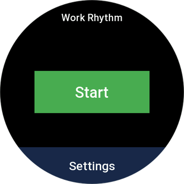
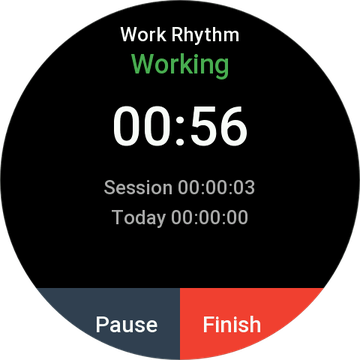
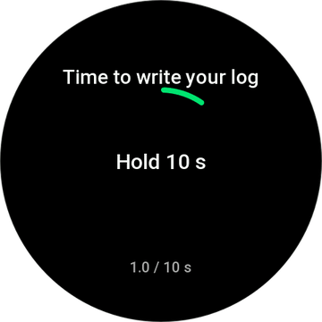
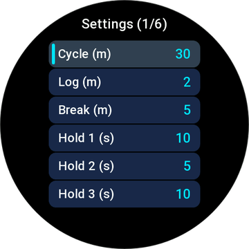

# Work Rhythm (工作节奏)

> A mindful rhythm & anti-burnout assistant for **Zepp OS** smartwatches.  
> 一款专为 **Zepp OS** 手表打造的防上头与工作节律健康助手。

[](https://docs.zepp.com/)
[](LICENSE)
[](#-supported-devices--支持设备)

---

## 📖 Why Work Rhythm? / 设计初衷

In deep work, programming, research, or writing, it is easy to fall into a **"tunnel vision trap" (上头)**:
- **Getting stuck**: Spending hours grinding on a single bug or equation with mounting mental fatigue and diminishing returns.
- **Lacking reflection**: Finishing a long day without knowing what key insights were actually achieved.
- **Physical burnout**: Hours of continuous sitting without water or movement.

**Work Rhythm** breaks this loop by introducing physical interrupts and forced cognitive resets right on your wrist:
1. **Focus (工作)**: Pure concentration on the current task.
2. **Log (写日志)**: A strong, alarm-level vibration forces you to pause and jot down thoughts/progress in your notebook or journal.
3. **Break (活动)**: Physical away-from-desk time to stretch, hydrate, and let your subconscious reorganize thoughts.
4. **Long-Press Confirmation (物理长按阻断)**: Every phase switch requires holding down on the watch face for several seconds. You cannot carelessly dismiss the prompt.

---

## 📸 Screenshots / 界面预览

| Home (首页) | Focus & Pause (专注与暂停) | Break Prompt (防上头长按) | Crown Settings (表冠设置) |
| :---: | :---: | :---: | :---: |
|  |  |  |  |

---

## ✨ Features / 核心功能

- 🔄 **3-Phase Rhythm Loop**: `Focus` ➔ `Log Progress` ➔ `Physical Break` ➔ `Next Focus`.
- 🛑 **Anti-Burnout Long-Press Unlock**: Alarm-level continuous vibration (`VIBRATOR_SCENE_TIMER`) with 3-minute screen-keep-on. Requires holding the screen for configured seconds (5s ~ 15s) to confirm phase completion.
- ⏸️ **Smart Pause & Session Tracking**: Pausing completely halts active work time calculation. Session countdown snapshot accurately resumes where you left off.
- ⏰ **1.5-Hour Pause Auto-Finish Prompt**: If paused for over 90 minutes, a dedicated reminder wakes up the watch to ask if you want to clock out, saving valid hours without draining battery.
- 👑 **Digital Crown Navigation**: Full hardware integration with the rotating crown for smooth menu selection and press-to-enter actions.
- 🌐 **Full Bilingual Support**: Built-in support for both English (`en-US`) and Simplified Chinese (`zh-CN`), matching the watch system language automatically.

---

## ⌚ Supported Devices / 支持设备

Native 480 × 480 circular round-screen Zepp OS devices:

- **Amazfit Balance** / Balance 2 / Balance 3 / Balance Ultra
- **Amazfit T-Rex 3** / T-Rex 3 Pro (48mm) / T-Rex Ultra 2
- **Amazfit Cheetah Pro** / Cheetah 2 Ultra
- **Amazfit Active Max**

---

## ⚙️ Configurable Parameters / 可调节参数

All intervals can be adjusted in the watch Settings page:

| Parameter (参数) | Description | Default | Range |
| :--- | :--- | :---: | :---: |
| **Cycle (循环)** | Focus work duration / 专注时长 | 30 min | 1 ~ 120 min |
| **Log (写日志)** | Forced reflection duration / 记录时长 | 2 min | 1 ~ 10 min |
| **Break (活动)** | Away-from-desk break / 活动时长 | 5 min | 1 ~ 15 min |
| **Hold 1 (长按1)** | Hold time to confirm work phase end | 10 s | 3 ~ 30 s |
| **Hold 2 (长按2)** | Hold time to confirm log phase end | 5 s | 3 ~ 30 s |
| **Hold 3 (长按3)** | Hold time to confirm break phase end | 10 s | 3 ~ 30 s |

---

## 🛠️ Development & Build / 本地开发

### Prerequisites
- Node.js >= 16
- [Zeus CLI](https://docs.zepp.com/docs/guides/tools/cli/):
  ```bash
  npm i @zeppos/zeus-cli -g
  ```

### Run in Simulator
```bash
zeus dev
```
Open **Zepp OS Simulator v2** to test features and interaction.

### Real-Device Preview
```bash
zeus preview
```
Scan the QR code with **Zepp App** ➔ Profile ➔ Settings ➔ Developer Mode ➔ Scan.

### Production Build
```bash
zeus build
```
The output `.zab` package will be generated under the `dist/` directory.

---

## 💬 Feedback & Support / 支持与反馈

If you encounter any bugs, have feature requests, or want to contribute:
- Please open an issue at: [GitHub Issues](https://github.com/cosmologychen/work-rhythm/issues)

---

## 📄 License

This project is licensed under the [MIT License](LICENSE).
